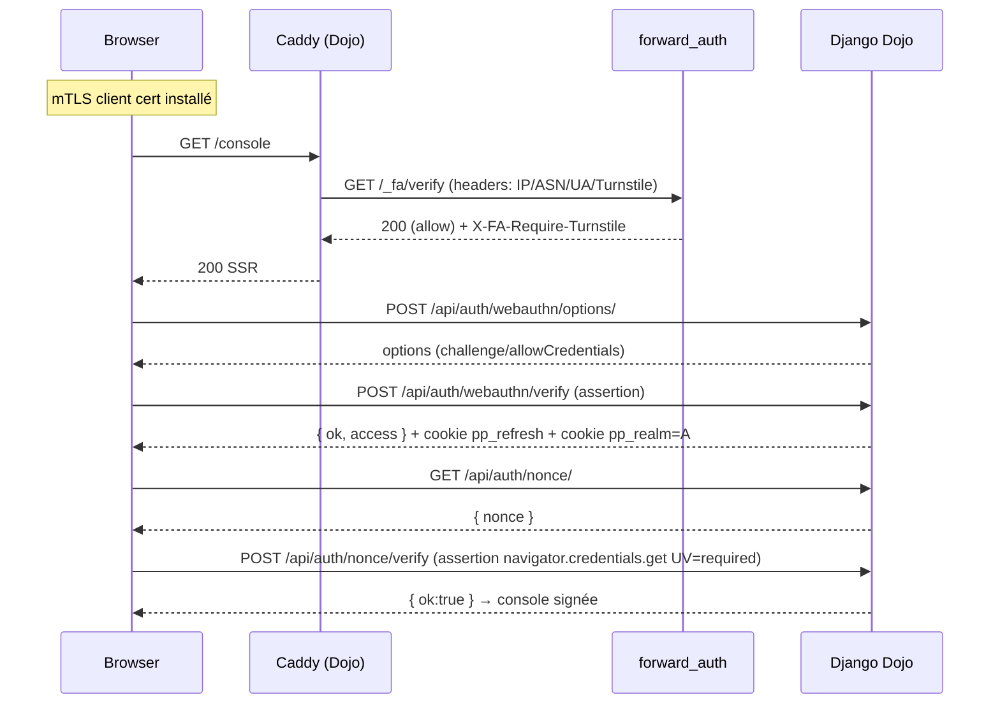
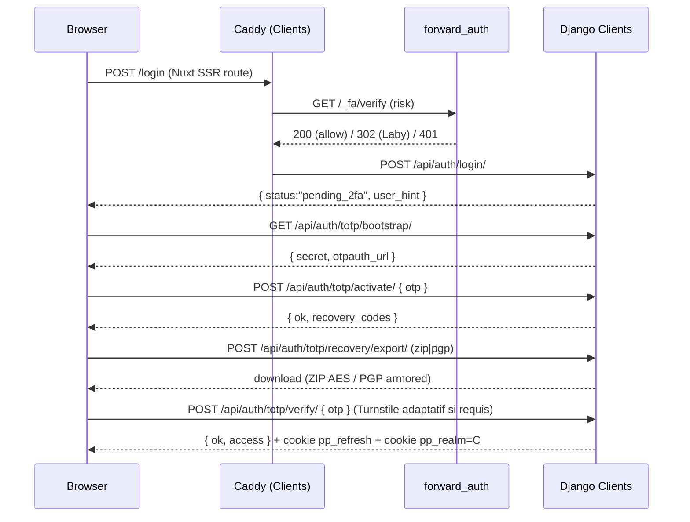
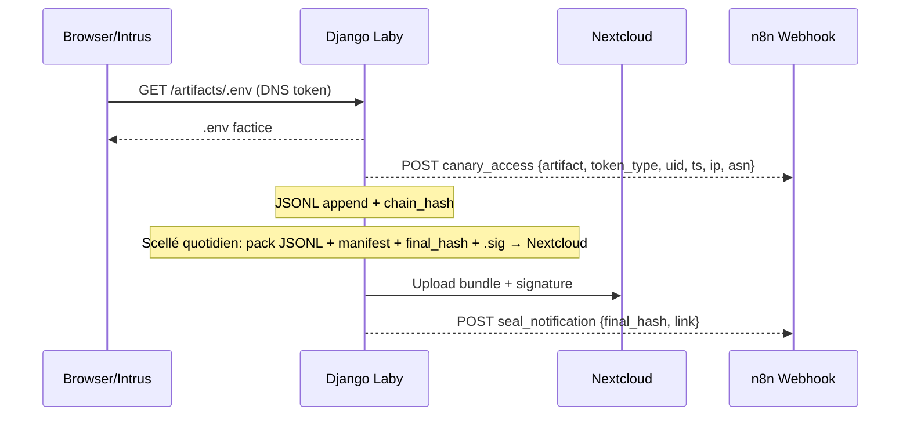

# README — Auth Architecture & Operations (PixelProwlers Studio)

Addendum — Incrément 4 “Finitions Sécu + Pages Nuxt + Preuves CI/CD”
- Ratelimits (au plus près du code)
  - Endpoints protégés via décorateurs django-ratelimit (en plus des helpers cache/tarpit):
    - POST /api/auth/login/ → 5/m/ip, 10/h/user
    - POST /api/auth/totp/verify/ → 5/m/ip (+ tarpit progressif côté serveur)
    - POST /api/auth/webauthn/options/ → 5/m/ip
    - POST /api/auth/webauthn/verify/ → 5/m/ip
  - Attendu tests: dépassement seuil → 429.
- Fenêtre OTP stricte
  - Vérification TOTP avec tolerance=1 (±1 step de 30s), sinon rejet.
  - Attendu tests: OTP à +2 steps → KO.
- Cookies blindés (host-only)
  - Cookies d’auth et de routage SSR uniquement:
    - __Host-pp_refresh (HttpOnly; Secure; SameSite=Strict; Path=/; aucun Domain)
    - __Host-pp_realm (HttpOnly; Secure; SameSite=Strict; Path=/; aucun Domain)
  - Aucun JWT dans localStorage/SessionStorage. Routage SSR via cookie HttpOnly pp_realm.
  - Attendu tests intégration: Set-Cookie contient bien le préfixe __Host- et les attributs requis.
- Rotation des clés JWT + JWK sets
  - kid injecté dans le header des tokens access; JWKS exposé par realm: GET /.well-known/jwks.json
  - Commande d’outillage de rotation (génération, overlap 24h, publication JWKS, aides env):
    - python manage.py rotate_jwt_keys --realm clients --out-dir ./secrets --jwks-out ./secrets/jwks.json --print-env
    - Option: --prev-public / --prev-kid pour publier la clé précédente en “validating only” durant la fenêtre de chevauchement.
  - Attendu tests intégration: refresh pendant chevauchement → OK; après retrait → OK avec la nouvelle clé.
- Scellé quotidien PGP + Nextcloud (Honeypot)
  - Commande: python manage.py seal_laby_bundle [--date YYYY-MM-DD] [--no-upload] [--no-sign] [--dry-run]
  - Produit: ZIP (events.jsonl du jour + manifest.json + final_hash.txt) + signature PGP détachée (.sig), upload WebDAV Nextcloud, webhook n8n.
  - Automatisation: cron/systemd timer/CI planifiée à 00:05 UTC. Vérification: gpg --verify final_hash.sig final_hash.txt
- Purge & rétention (RGPD)
  - Commande: python manage.py purge_old_events --days 90 [--jsonl PATH] [--backup-dir DIR] [--gzip] [--dry-run]
  - Purge les entrées JSONL antérieures au cutoff; sauvegarde optionnelle des lignes purgées; le chaînage hash reste vérifiable via les scellés historiques.
- CSP “enforce” et rapports
  - CSP active côté proxy (Caddy) et/ou app; connect-src: 'self' https://challenges.cloudflare.com /_fa/verify /api/*
  - Endpoint de rapports actif: /api/csp-report. Passage en enforce après ≥ 48 h sans violations en staging.
  - Attendu tests: aucune violation sur pages index/console/dashboard.
- mTLS harness (Dojo)
  - Scénarios à valider: cert client valide → 2xx Dojo; cert invalide/absent → rejet par le proxy (4xx) avant Django.
  - Fournir cible docker-compose / make pour lancer Caddy avec mTLS (certs de test).
- Pages Nuxt (SSR-first, sans fuite de jetons)
  - pages/index.vue: login universel + Turnstile; Clients → login→TOTP (bootstrap/activate si nécessaire)→verify→dashboard; Dojo → WebAuthn (options/verify)→console.
  - pages/console.vue (Dojo): bouton “Signer” → navigator.credentials.get(UV=required) sur nonce; affiche état “console signée”.
  - pages/dashboard.vue (Clients): onboarding TOTP + export recovery (ZIP AES-256 avec mot de passe saisi; PGP si clé fournie).
  - pages/console.vue (Laby): illusion crédible + liens artefacts canarisés; latences simulées, zéro effet prod.
  - middleware/realm.global.ts: lecture SSR-only de __Host-pp_realm et garde de route A/C/H.
- CI/CD — Preuves et artefacts
  - Unit + Intégration + E2E Playwright (headless) exécutés en pipeline:
    - Rapports JUnit + couverture publiés en artefacts.
    - Captures E2E (succès/échec) attachées.
    - Checks de conformité: CSP enforce (aucune violation), mTLS harness (2 comportements), JWKS exposé, cookies __Host- présents.
  - Publication (préprod): hash scellé du jour inclus en artefact si présent.


Status: Phase 2 (Incrément final) — “Full Auth réelle + Honeypot Actif + Nuxt Branché”
Audience: Dev/DevOps/QA/SecOps
Priorité: sécurité > ergonomie > design

Ce document centralise:
- Les concepts (realms), les flux d’authentification et de décision “front door”.
- Les prérequis et la procédure de déploiement (Caddy, Django/DRF, Nuxt).
- Les endpoints principaux et la logique de cookies/JWT.
- Les diagrammes d’architecture/flux (placeholders mermaid) pour la documentation technique.
- Les opérations de l’antichambre (honeypot) et le scellé quotidien (PGP + Nextcloud).


## 1) Vue d’ensemble

Realms (origines/applications isolées)
- Dojo (Admins)
  - Accès ultra-durci.
  - mTLS client obligatoire au reverse proxy + WebAuthn (passkeys) via allauth.mfa.
  - JWT “A” avec issuer/audience/clé RS256 dédiés; cookies HttpOnly spécifiques; accès console signé (nonce).
- Clients (Accrédités)
  - Auth email+MDP + TOTP (2FA) obligatoire (onboarding propre: QR, activation, recovery codes).
  - JWT “C”, refresh rotation + blacklist; cookies HttpOnly spécifiques.
- Laby (Antichambre / Honeypot)
  - Leurres plausibles (API no‑op / pseudo-admin) + artefacts canarisés (.env, id_ed25519, notes_admin.txt).
  - Journal JSONL à hash chaîné; scellé quotidien (PGP) déposé sur Nextcloud; notification webhook (n8n).

Front door (Caddy)
- mTLS client pour Dojo (CA privée).
- forward_auth (passerelle de décision): 200/302/401 selon score de risque (UA headless, ASN/IP, Turnstile, OTP fails).
- CrowdSec bouncer (si activé): bloque amont.
- Headers sécu: HSTS, XFO=DENY, COOP/COEP/CORP; CSP stricte (connect-src adapté).

Back (Django/DRF)
- JWT RS256 par realm (issuer/audience/keys). Cookies HttpOnly Secure SameSite stricts.
- Dojo: WebAuthn allauth.mfa (options/verify) + nonce console.
- Clients: TOTP bootstrap/activate/verify, recovery codes hashés, export ZIP AES/PGP.
- Laby: endpoints no‑op plausibles avec latences crédibles; artefacts canarisés; JSONL + chain_hash; webhook.

Front (Nuxt 3 + SSR)
- Pages: index (login + Turnstile), console (Dojo/Laby), dashboard (Clients).
- Middleware SSR-only: lecture cookie pp_realm (A/C/H) et garde de route (aucun JWT côté JS).
- Routes serveur Nuxt: proxys d’auth (login, totp, webauthn, nonce), /_fa/verify, etc.


## 2) Prérequis & dépendances

Infra/Logiciels
- Caddy v2 (build avec modules: CrowdSec bouncer, éventuellement greenpau auth suite, geolocation MaxMind).
- Python 3.13 + Poetry (backend).
- Node 22 + npm (frontend).
- PostgreSQL (prod/staging); SQLite acceptable en dev/test.
- Nextcloud (accès programmatique pour dépôt des scellés journaliers).
- n8n (ou équivalent) pour webhook (alerting canaries/scellé).

Secrets/Clés
- Clés RS256 par realm:
  - Dojo: DOJO_JWT_PRIVATE_KEY / DOJO_JWT_PUBLIC_KEY
  - Clients: CLIENTS_JWT_PRIVATE_KEY / CLIENTS_JWT_PUBLIC_KEY
  - Laby: LABY_JWT_PRIVATE_KEY / LABY_JWT_PUBLIC_KEY
- Cloudflare Turnstile:
  - TURNSTILE_SECRET (serveur) + sitekey (front).
- mTLS Dojo:
  - CA clients: ca_admin_clients.pem (sur le host Caddy).
- PGP (optionnel pour export recovery + signature scellé):
  - Clé publique admin (ASCII-armored).
  - Clé privée “sig scellé” sur un runner sécurisé (si exigée).

Environnements & variables (exemples non exhaustifs)
- Realm Dojo:
  - DJANGO_SETTINGS_MODULE=studio_core.settings.realms.dojo
  - DJANGO_ALLOWED_HOSTS=dojo.pixelprowlers.studio
  - JWT_ISSUER=https://dojo.pixelprowlers.studio
  - JWT_AUDIENCE=dojo-admins
  - DOJO_JWT_PRIVATE_KEY / DOJO_JWT_PUBLIC_KEY
  - SITE_ID=1, ACCOUNT_AUTHENTICATION_METHOD=email, ACCOUNT_EMAIL_VERIFICATION=none
- Realm Clients:
  - DJANGO_SETTINGS_MODULE=studio_core.settings.realms.clients
  - DJANGO_ALLOWED_HOSTS=clients.pixelprowlers.studio
  - JWT_ISSUER=https://clients.pixelprowlers.studio
  - JWT_AUDIENCE=clients-users
  - CLIENTS_JWT_PRIVATE_KEY / CLIENTS_JWT_PUBLIC_KEY
- Realm Laby:
  - DJANGO_SETTINGS_MODULE=studio_core.settings.realms.laby
  - DJANGO_ALLOWED_HOSTS=laby.pixelprowlers.studio
  - JWT_ISSUER=https://laby.pixelprowlers.studio
  - JWT_AUDIENCE=laby-honeypot
  - LABY_JSONL_PATH, LABY_CHAIN_STATE_PATH, LABY_WEBHOOK_URL
  - LABY_DNS_TOKEN_DOMAIN, LABY_URL_TOKEN_BASE
- Forward Auth:
  - FORWARD_AUTH_BAD_ASN="AS123,AS999"
  - FORWARD_AUTH_BLOCK_IPS="1.2.3.4"
  - FORWARD_AUTH_REQUIRE_TURNSTILE=0/1
  - FORWARD_AUTH_TURNSTILE_THRESHOLD=40
  - FORWARD_AUTH_REDIRECT_THRESHOLD=80
  - TURNSTILE_SECRET
- Caddy upstreams (exemple):
  - DJANGO_DOJO_UPSTREAM, DJANGO_CLIENTS_UPSTREAM, DJANGO_LABY_UPSTREAM
  - NUXT_CLIENTS_UPSTREAM, NUXT_LABY_UPSTREAM
  - AUTH_GATEWAY_URL (si forward_auth externe)


## 3) Déploiement (résumé)

1) Caddy (front door)
- Construire Caddy avec les plugins requis (via xcaddy).
- Définir les vhosts:
  - dojo.pixelprowlers.studio: mTLS client require_and_verify (trusted_ca_cert_file), forward_auth, CrowdSec.
  - clients.pixelprowlers.studio: fanout web (Nuxt) et /api (Django), forward_auth (optionnel).
  - laby.pixelprowlers.studio: façade honeypot (Nuxt/”web”) + API laby.
- CSP: connect-src 'self' https://challenges.cloudflare.com /_fa/verify /api/*; HSTS/COOP/COEP/CORP, XFO=DENY.

2) Backends Django
- Dojo: settings “dojo”, RS256 clés Dojo, allauth.mfa activé, WebAuthn options/verify câblés.
- Clients: settings “clients”, RS256 clés Clients, TOTP bootstrap/activate/verify, export recovery ZIP/PGP.
- Laby: settings “laby”, endpoints no-op plausibles, artefacts canarisés, JSONL + chain_hash + webhook.

3) Front Nuxt 3
- pages/index.vue, console.vue (Dojo/Laby), dashboard.vue (Clients).
- middleware/realm.global.ts: lecture HttpOnly cookie pp_realm (SSR-only).
- server/api/auth/*.ts: proxys login/totp/webauthn/nonce; theme (compat); /_fa/verify.

4) Secrets & sécurité
- Jamais de JWT en stockage Web; cookies HttpOnly/Secure/SameSite strict.
- RS256 par realm (keys en ENV/Secrets).
- mTLS Dojo actif (tester certs invalides → rejet).
- Turnstile: /login obligatoire; /totp/verify “adaptatif” selon risque (flag via forward_auth).


## 4) Endpoints (principaux)

Dojo (Admins)
- POST /api/auth/webauthn/options/ → PublicKeyCredentialRequestOptions (allauth)
- POST /api/auth/webauthn/verify/ → assertion valide → JWT-A + cookie refresh, cookie realm=A
- GET /api/auth/nonce/ → { nonce }
- POST /api/auth/nonce/verify → vérifie signature WebAuthn/nonce

Clients (Accrédités)
- POST /api/auth/login/ → { status: "pending_2fa", user_hint }
- GET  /api/auth/totp/bootstrap/ → { secret, otpauth_url }
- POST /api/auth/totp/activate/ → { otp } → { ok, recovery_codes }
- POST /api/auth/totp/verify/ → { otp } → JWT-C + cookie refresh, cookie realm=C
- POST /api/auth/totp/recovery/export/ → ZIP AES (pwd user) ou PGP (clé publique)

Gateway (Front door)
- GET /_fa/verify → 200 (OK) | 302 (redir Laby) | 401 (blocage), JSON + headers:
  - X-FA-Require-Turnstile: 1/0 (flag adaptatif pour OTP)
  - X-Correlation-ID (tracing)

Laby (Honeypot)
- /api/projects/*, /api/agents/*: no-op plausibles (latences simulées, payloads crédibles)
- /admin/login/: page plausible
- /artifacts/.env, /artifacts/id_ed25519, /artifacts/notes_admin.txt: artefacts canarisés
- /laby/health: sonde interne
- Journal JSONL (ts_utc, ip, asn, ua, route, payload_size, decision, chain_hash)


## 5) Diagrammes (placeholders)

Architecture globale
```mermaid
flowchart LR
  subgraph Client
    Browser[Browser (Nuxt 3)]
  end
  subgraph FrontDoor[Caddy v2]
    mTLS[Dojo: mTLS (client_auth)]
    fwd[forward_auth (/_fa/verify)]
    csp[CSP/HSTS/COOP/COEP/CORP]
  end
  subgraph Backends[Django/DRF]
    Dojo[Realm Dojo (WebAuthn allauth.mfa)]
    Clients[Realm Clients (TOTP 2FA)]
    Laby[Realm Laby (honeypot)]
  end
  subgraph NuxtSSR[Nuxt SSR]
    Web[Clients web]
    LabyWeb[Laby façade]
  end
  Browser -- HTTPS --> FrontDoor
  FrontDoor -- reverse_proxy --> NuxtSSR & Backends
  FrontDoor -- (_fa/verify) --> Backends
  Dojo <---> Clients
  Laby -. isolated .- Dojo
  Laby -. isolated .- Clients
```

Flux Dojo (mTLS + WebAuthn + Nonce)


Flux Clients (login + TOTP + recovery export)


Flux Honeypot (canaries + journal/scellé)



## 6) Procédures d’exploitation

Scellé quotidien (PGP + Nextcloud)
- À la rotation journalière:
  - Calculer le “final_hash” (dernier chain_hash).
  - Pack “journaux”:
    - JSONL complet du jour, manifest (métadonnées), final_hash.txt
  - Signature PGP détachée (.sig) du final_hash ou du pack (selon politique).
  - Dépôt sur Nextcloud (dossier/nommage YYYY‑MM‑DD).
  - Notification webhook (n8n) avec: date, final_hash, lien Nextcloud, horodatage externe.
- Retention: définir durée, accès “read-only” pour audit.

Turnstile adaptatif
- /login: Turnstile obligatoire (vérifié serveur).
- /totp/verify: suivre le flag X-FA-Require-Turnstile (forward_auth); refuser si exigé et non fourni.
- Tuner les seuils via env:
  - FORWARD_AUTH_TURNSTILE_THRESHOLD
  - FORWARD_AUTH_REDIRECT_THRESHOLD
  - FORWARD_AUTH_OTP_FAILS_THRESHOLD


## 7) Sécurité & conformité

- Cookies: HttpOnly, Secure, SameSite=Strict (prod); jamais de JWT en localStorage.
- RS256 par realm: issuer/audience/clés indépendants; cross-realm rejeté.
- mTLS Dojo: cert client valide requis (Caddy bloque avant l’app).
- allauth.mfa WebAuthn: Passkeys obligatoires pour Admins (Dojo).
- TOTP Clients: activation propre + recovery codes hashés; export chiffré ZIP/PGP.
- forward_auth: logs JSON corrélables (correlation_id), décisions 200/302/401, raisons[] et risk_score.
- CSP stricte; connect-src ajusté (self, Turnstile, /_fa/verify, /api/*).
- RGPD: minimiser PII; rétention documentée; droit d’accès realm Clients.


## 8) Tests (résumé des attentes)

Unit (pytest)
- WebAuthn options/verify (mocks allauth): OK/KO → cookies + JWT-A.
- TOTP: bootstrap/activate/verify; recovery codes hashés; export ZIP/PGP (mocks libs).
- SimpleJWT: rotation refresh + blacklist après rotation.
- forward_auth: 200/302/401 selon combinaisons; flag Turnstile requis pour OTP.

Intégration
- mTLS: dojo.* sans cert → inaccessible (Caddy bloque).
- Cross-realm: JWT‑H/C refusés sur Dojo; JWT‑H refusés sur Clients.
- CSP: aucune violation sur index/console/dashboard.
- Scellé Nextcloud: bundle + .sig présents; hash cohérent avec notif webhook.

E2E (Playwright)
- Admin légitime: mTLS + passkey + nonce signé → console Dojo OK.
- Admin sans passkey: bascule Laby silencieuse.
- Client sans TOTP: onboarding (QR) → activation → verify → dashboard; ZIP chiffré OK.
- Bot/headless: /login sans Turnstile → bloqué; /totp/verify risk élevé → Turnstile exigé; sinon redir Laby.
- Canaries: ouverture .env (DNS) / notes_admin.txt (URL) → webhook reçu.


## 9) Annexes

Endpoints d’auth (résumé rapide)
- Dojo:
  - POST /api/auth/webauthn/options/
  - POST /api/auth/webauthn/verify/
  - GET  /api/auth/nonce/
  - POST /api/auth/nonce/verify
- Clients:
  - POST /api/auth/login/
  - GET  /api/auth/totp/bootstrap/
  - POST /api/auth/totp/activate/
  - POST /api/auth/totp/verify/
  - POST /api/auth/totp/recovery/export/
- Gateway:
  - GET  /_fa/verify
- Laby:
  - GET  /api/projects/
  - GET|PATCH|DELETE /api/projects/:slug/
  - POST /api/projects/
  - GET  /api/agents/
  - POST /api/agents/:slug/ask
  - GET  /admin/login/
  - GET  /artifacts/.env
  - GET  /artifacts/id_ed25519
  - GET  /artifacts/notes_admin.txt
  - GET  /laby/health

Notes de configuration
- Ajuster CORP/COOP/COEP selon besoins d’embed/Worker.
- CSP: passer en “report-only” en staging puis “enforce”.
- N’oubliez pas de définir un Request ID (X-Request-ID) en amont pour corrélation.

Champs de logs recommandés (JSON)
- time, level, component, correlation_id, client_ip, asn, ua, realm, route, decision, risk_score, reasons[], status, duration_ms.


---

Fin — Cette page sert de source de vérité opérationnelle pour l’auth multi‑realms, la gateway de décision, l’antichambre, et la posture de sécurité associée. Les blocs mermaid ci‑dessus sont des placeholders à enrichir au fil de l’implémentation et des retours tests.
